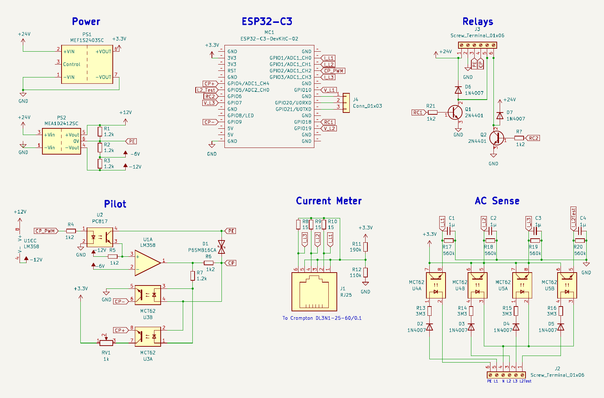
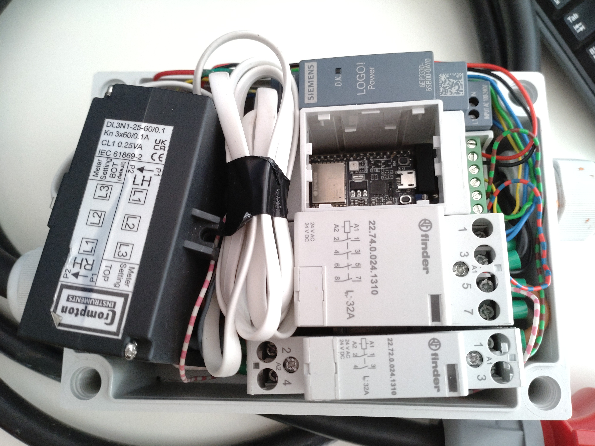

# ϕ-EVSE hardware

These are the schematics for the ϕ-EVSE project. See also the [project README](../README.md).

## Design notes

- The device is controlled by an ESP32-C3 microcontroller. In this case, it's using a devkit mounted into a prototype board.
- The power system generates 24V (for the relays), ±12V (for the control pilot) and 3.3V (for the electronics).
- The control pilot circuitry is optically isolated from the car. This difers from the standard control circuit and adding optocouples caused issues with switching speed and accurately setting the duty cycle.
- There is a current meter using a current transformer and shunt resistor connected to an ADC pin for each phase.
- There are four AC sensors (optocouplers with a capacitor for smoothing the signal). Three of them check the output of the relay (to check for stuck relays) and the forth one is used to check if 3-phase power is available at the input.

## Mounting

Everything is mounted on a DIN rail inside a CamdemBoss CHDX6-230 enclosure:
- 24V power supply, no special requirements.
- Enclosure for the electronic (CamdemBoss CNMB/2/KIT)
- Main power contactor: 4-pole contactor. Using Finder 22.74.0.024.1310 for the small size while supporting 32A.
- 1-3 phase contactor: 2-pole contactor. Using Finder 22.72.0.024.1310 for the small size while supporting 32A.

